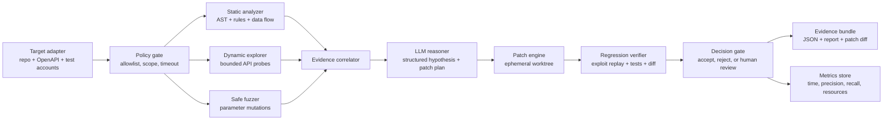

# Kavach Sentinel — Architecture and Evaluation Protocol

## 1. Product definition

**Kavach Sentinel** is a sandbox-only security automation pipeline for Python REST APIs. Its first release targets three API vulnerability classes: Broken Object Level Authorization, Broken Function Level Authorization, and Security Misconfiguration. The system is designed to satisfy the AI Kavach requirement for an LLM combined with fuzzing, static analysis, dynamic analysis, and regression testing while keeping execution deterministic and auditable.

The system must never scan or patch real public systems. It accepts either a synthetic service repository or an organiser-provided sandbox adapter, runs inside an isolated environment, and produces a finding, a proposed patch, a validation result, and an evidence bundle.

## 2. High-level architecture

## 3. Component responsibilities

| Component | Responsibility | Must not do |
|---|---|---|
| Target adapter | Load repository, OpenAPI specification, seeded identities, and test data; expose a local-only interface. | Discover arbitrary hosts or expand beyond the declared target. |
| Policy gate | Enforce target scope, command allowlist, network deny-by-default, timeouts, CPU/memory limits, and maximum request counts. | Allow the LLM to select arbitrary shell commands or destinations. |
| Static analyzer | Parse Python AST and inspect route definitions, authorization checks, dangerous configuration, and data-flow indicators. | Claim a vulnerability without corroborating evidence or confidence. |
| Dynamic explorer | Enumerate declared routes and run safe authenticated/unauthenticated probes using synthetic identities and canary objects. | Send destructive requests or access external systems. |
| Safe fuzzer | Mutate IDs, roles, query parameters, JSON types, and bounded payload sizes to test hypotheses. | Perform unbounded fuzzing, denial-of-service testing, or internet scanning. |
| Evidence correlator | Join request/response traces with source locations, route metadata, and test outcomes. | Treat a single anomalous response as proof. |
| LLM reasoner | Convert evidence into a structured vulnerability hypothesis, severity rationale, patch plan, and test plan. | Execute tools, directly edit production files, or invent evidence. |
| Patch engine | Apply a constrained patch in an ephemeral worktree and record the exact diff. | Modify the baseline or bypass review gates. |
| Regression verifier | Replay the exploit, run baseline tests, run security tests, and compare behaviour before and after patching. | Accept a patch that only hides the symptom or breaks normal functionality. |
| Decision gate | Accept only when exploit reproduction fails after patching, functional tests pass, and policy checks pass. | Auto-promote uncertain or unsafe changes. |

## 4. Standard operating flow

### Stage A — Establish the baseline

The adapter verifies that the repository is inside the approved workspace, records a content hash, starts the service locally, runs the existing test suite, and stores a baseline health report. The baseline must be green or the system must label pre-existing failures so that a later patch is not credited for unrelated changes.

### Stage B — Discover the attack surface

The adapter imports the OpenAPI document when available. If the specification is absent, the static analyzer extracts route decorators and parameter definitions from the source. Each route is assigned a stable identifier containing method, path template, handler, and expected role requirements.

### Stage C — Run bounded dynamic probes

The explorer creates test identities such as `operator_a`, `operator_b`, and `admin_test`, plus synthetic objects owned by each identity. For BOLA testing, it replaces an object identifier belonging to one identity with a canary identifier belonging to another and compares status code, response shape, and canary leakage. For BFLA testing, it compares access to administrative endpoints across roles. For misconfiguration testing, it checks safe indicators such as debug mode, permissive CORS, missing security headers, and verbose error responses.

### Stage D — Correlate static and dynamic evidence

A finding is considered strong when dynamic behaviour and source evidence agree. For example, an IDOR candidate should show cross-identity access in the local lab and a handler path that retrieves an object by user-controlled ID without an ownership or role check. The correlator assigns evidence levels: `confirmed`, `probable`, `suspected`, or `rejected`.

### Stage E — Generate a structured patch plan

The LLM receives only sanitized evidence: route metadata, relevant source slices, test traces, and the allowed patch patterns. It returns JSON validated against a schema containing the vulnerability class, explanation, exact source locations, patch strategy, risk, new tests, and expected post-patch behaviour. The model is not permitted to return shell commands or arbitrary file operations.

### Stage F — Apply in an ephemeral worktree

The patch engine creates a copy-on-write worktree, applies a minimal diff, runs formatting and syntax checks, and records the patch hash. Patch patterns are constrained to approved transformations such as ownership checks, role guards, parameterized queries, secure configuration defaults, and explicit error handling.

### Stage G — Prove the fix

The verifier must satisfy all of the following: the original exploit no longer succeeds; the legitimate owner or authorised role retains access; security regression tests pass; the baseline functional suite passes; no new high-confidence finding is introduced; and the patch stays within the declared files and resource budget. A failed condition yields `rejected` or `human_review`, never an automatic pass.

## 5. Initial benchmark design

| Benchmark element | Initial target |
|---|---:|
| Synthetic services | 12 small Python REST services |
| Seeded vulnerable cases | 20 cases across BOLA, BFLA, and security misconfiguration |
| Secure controls | 20 intentionally safe cases to measure false positives |
| Development split | 60% of cases |
| Validation split | 20% of cases |
| Hidden holdout | 20% of cases, never used for prompt or rule tuning |
| Maximum requests per service | 300 for the first prototype |
| Maximum execution time | 10 minutes per service in development; configurable for finale adapter |
| Network policy | Localhost or container network only; external egress denied |

The holdout set should vary route names, variable names, object schemas, role names, and code layout so the system is tested for generalisation rather than memorisation. Vulnerable and secure versions should be paired where possible, allowing the evaluator to check whether the system distinguishes a real flaw from a safe implementation.

## 6. Metrics and acceptance gates

| Metric | Definition | Prototype target |
|---|---|---:|
| Recall | Confirmed seeded flaws found / total seeded flaws | At least 80% on validation set |
| Precision | True findings / all reported findings | At least 75% on validation set |
| Patch success | Patches satisfying exploit, regression, and functional gates / attempted patches | At least 70% |
| False-fix rate | Patches that stop the exploit but break legitimate behaviour / accepted patches | Below 10% |
| Regression pass rate | Accepted patches with all required tests passing | At least 90% |
| Median time to validated fix | From service start to accepted patch | Less than 5 minutes locally |
| Resource use | Peak RAM, CPU time, and model calls per service | Report, cap, and optimise |
| Safety violations | Out-of-scope requests, blocked commands, or egress attempts | Zero tolerated |

These are internal engineering targets, not claims about the organisers’ rubric. The team should present measured results with confidence intervals or repeated-run summaries rather than unsupported performance claims.

## 7. Evidence bundle

Each finding should produce a machine-readable record with `finding_id`, `class`, `route`, `preconditions`, `request_trace`, `response_diff`, `source_locations`, `confidence`, `severity_rationale`, `patch_diff`, `reproduction_test`, `regression_results`, `resource_usage`, and `decision`. A human-readable report should show the baseline failure, the patch, and the post-patch proof in that order.

## 8. Safety and governance controls

The LLM is advisory. A deterministic policy layer controls target scope, tools, files, commands, request counts, and network access. All test data must be synthetic or organiser-provided dummy data. The system must log every probe, patch, and decision with timestamps and hashes. Any uncertainty, test failure, unexpected endpoint, or scope violation should trigger a safe stop and human review.

This design follows the event’s sandbox-only wording and is consistent with OWASP’s use of security verification requirements and NIST’s emphasis on secure environments, producing well-secured software, and responding to vulnerabilities.[1] [2] [3]

## References

[1]: https://www.cyberchallenge.in/tcq2026 "Terrier Cyber Quest 2026 official event page"

[2]: https://owasp.org/www-project-application-security-verification-standard/ "OWASP Application Security Verification Standard"

[3]: https://csrc.nist.gov/projects/ssdf "NIST Secure Software Development Framework"
